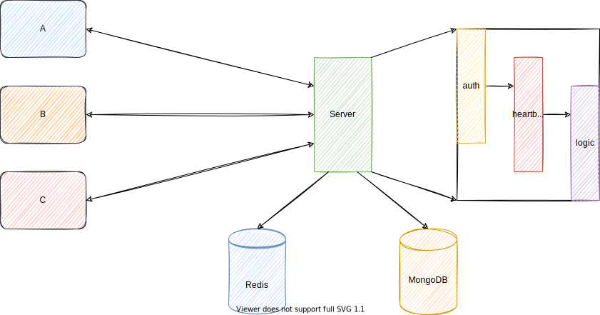
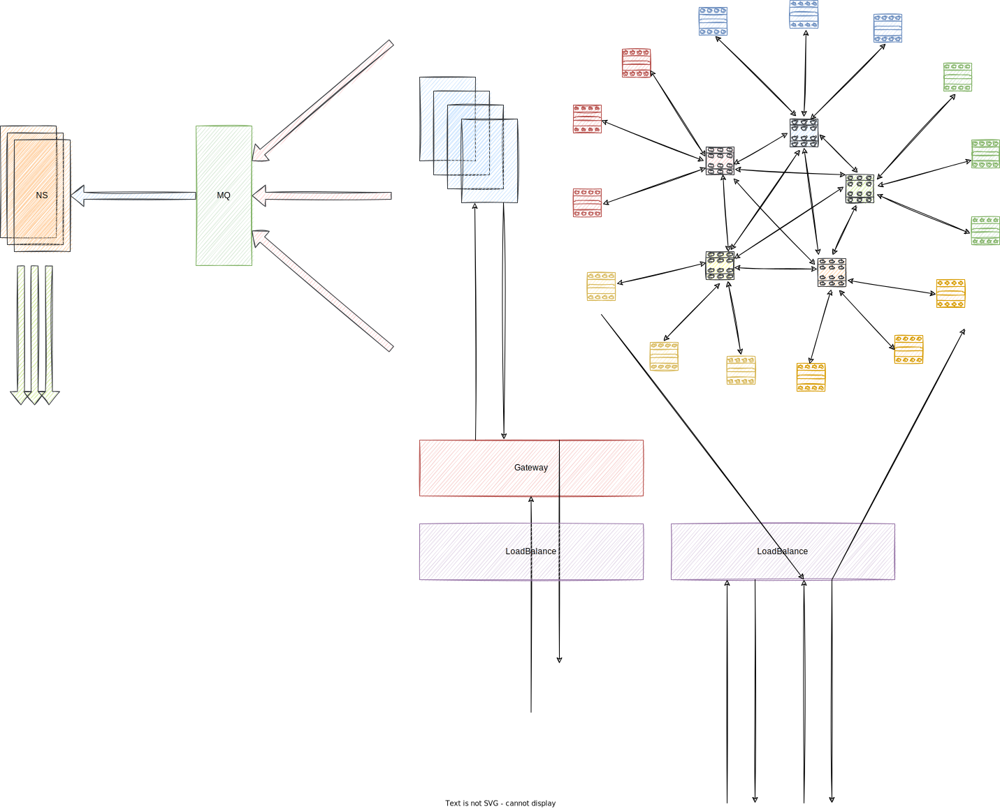

## 系统设计

### 🍍实现

#### 🍎通信

我们借鉴了QQ的实现，选择使用QUIC作为通信协议，同时自定义消息格式(基于长度分隔)。

但是由于国内对于UDP流量不友好，所以TCP会作为后备协议启用，且实现自动切换(TODO)。

关于QUIC协议是什么以及为什么要选择QUIC，可以参见[quic协议快速一览](https://zhuanlan.zhihu.com/p/571951327)。

#### 🍏消息设计

首先定义消息类型：

- 消息部分
    - 文本
    - 表情
    - 图片
    - 视频
    - 文件
    - 音频
- 逻辑部分
    - 确认：仅限给发送端；第二客户端走的是原类型
    - 收件箱：获取不在线期间有哪些发送者
    - 认证：连接授权，作为连接之后第一条消息发送，授权失败会直接断开连接
    - 错误：包含错误提示
    - 下线：用于服务器伸缩重连接
    - 心跳：进行心跳保持存活
    - 内部错误：需要内部逻辑处理
- 业务部分
    - 关系变更：添加好友，删除好友
    - 系统通知：一些用于全局通知的消息
- 其余部分可参见`lib/entity/mod.rs`中关于`Type`的定义。

其次是消息结构：

这里是展开结构，为了节省传输带宽，我们对消息头进行了压缩，最终得到一个32字节的消息头：

而消息的整个结构如下：

#### 🍊网关

网关部分是留给业务部分使用，因为考虑到如果把消息连接交给网关，最后还是要网关扛住多连接，转发给目标用户，维持连接等操作，这样作用和服务端差不多，索性直接把连接丢给服务端处理，网关仅处理CRUD的操作。

但是作为代价就是服务端需要处理部分业务逻辑。不过换种思路，反正服务端的核心就是负责抗大量的活跃连接同时转发消息给某一个连接，如果抽离出来业务模块，只是多了两条转发路径，但是减少了耦合度，而且还引入了M:N的集群设计，徒增工作量。

#### 🍋负载均衡

主要根据消息的sender进行均衡请求，尽量保证同一个发送方的消息落在一个服务器上。

#### 🍉逻辑

##### 🍑消息模型

上面已经提及，这里说一些细节，比如消息头的timestamp指的是服务端的时间，即消息实际送达的时间。

seq_num指的是消息之于发送者的序列号，确保发送者发送的顺序，在服务端进行递增处理，即客户端发送的顺序无法决定目标用户阅读的顺序，而是取决于消息到达服务端的顺序。

此外，服务端对于消息的处理，是push模型，即主动推送。在目标用户在线的状态下进行推送消息。

sender和receiver之间维护一个**信道**，里面按照时间顺序保存二人的消息，所以sender+receiver+seq_num可以唯一确定一条消息。

这里需要说明一下，如果沟通双方都在线，则进行正常通信即可，而对于重新上线的和第二个设备，则需要先拉取历史消息，然后进行收发操作。

对于客户端发送的消息，服务端在接收之后，对于回执的处理，分为：

- 发送本体端：回执一个Ack
- 同一用户其他在线端：发送消息副本

客户端本身需要做重排和同步，即通过检查消息的连续性进行判断是否需要重新拉取消息列表。

一种可能的实现是客户端在发现乱序之后，等待一定时间；超时之后，还是没有收到预期的消息，则申请信道进行同步。

关于申请请求的通信，选择使用消息包装，接收方为服务器，一方面是为了延迟，另一方面是为了统一，因为这本身属于消息逻辑的一种。

补充一个功能，就是消息列表，这一功能用于用户不在线时，在第一时间上线后得知哪些人曾经发来过消息；通过sender+receiver去寻找信道，进而获得未读消息。

这一功能需要服务端通过心跳记录客户端上次在线时间，收件箱则保存这一时间到当前时间的发送者列表。对于多端则忽略差异，以最新上线时间为准。

##### 🥭群聊

单聊实现很简单，难点在于群聊，这里把一个群当做一个信道对待，给群发消息就是给信道写消息，所有群友共享一个信道，所以每次信道更新，都会对群友写消息(**写扩散**)

这样对于群的发送来说，无疑是压力巨大的；然而如果是群友主动拉取则会发生延迟问题，所以我们**限定群的大小**。

此外这条群“信道”是所有人可见且保持一致性的，即每一个人看到的都是一样的。

这里需要说明的是，还需要一个通信质量检测机制，如果客户端发现自己的网络不好，需要定期重新拉取信道，以此来完成最新视图的更新。

#### 🍇持久化

关于信道的保存，因为涉及很多的读写操作，所以使用Redis，而且可以借助有序列表来实现。

而对于消息的持久化，选一个数据库就行了，这里图简单选MongoDB。持久化之后需要删除Redis对应的数据，以此节省内存。

#### 🍓状态

通过心跳维持，设定心跳间隔，如果超时则认为下线。

#### 🫐CAP

一致性，可用性，分区容错性，这里实现可用性和分区容错性，一致性实现最终一致性即可。

#### 🍒通知

抽离成单独的模块，实现类似消息，需要在客户端建立后台线程进行接收，后台线程始终维持一个连接即可。当然了像iOS有APNS这样的机制，这里仅限安卓，至于网页则不太好做驻留。

在抽离出单独的模块之后，可以通过消息队列解耦，通知系统的服务端会拉取消息然后进行通知，消息系统的服务端会在新的消息到达时向消息队列写入消息。

通知消息的实现不是TCP，而是UDP；原因在于通知对于消息丢失的容忍度没那么高，而且强调立即推送。具体细节会在通知模块实现里细说。

### 🥥未来实现

## 🥝版本迭代

### 🍅0.1.0

第一版只有简单的单机发送消息的功能，这里的发送消息包括P2P也包括P2G，即一致性。

### 🍆0.2.0

第二版引入网关和负载均衡，以及集群功能。即分区容错性。

具体核心架构如图：

这里要求用户注册的账号需要随机生成，并且通过取模获得具体分区，这个算法也是负载均衡使用到的。

后端负责授权鉴权，并返回带有Token的结果，然后客户端请求负载均衡服务器得到目标业务服务器，连接并发送Token。

我们需要一个算法，可以快速计算出用户所在的服务器，前面提到取模的措施，但是这样在扩缩容时会发生重置，涉及到的流量较大，或者使用Redis的Cluster，通过虚拟节点来减轻流量迁移。暂时图简单，先使用存储的形式。

补充一下，想到了一个方法，就是借助虚拟节点，在负载均衡时计算当次连接请求的实际节点。而如果发生了扩缩容，把涉及到的连接发送断开消息，让客户端主动断开并再次查询新的服务器地址，然后去连接：

在这里可以理解到，应该有这样的伸缩处理顺序：

- 伸缩服务器
- 设置load balance配置
- 设置Router配置(同上)
- 断掉后一段涉及到的连接
- 等待连接重新加入

现在想想其实也可以不断掉连接，进行平滑过渡。

对于快速查找取模结果落在哪个服务器，我们需要维护一个消息节点数组，然后通过二分查找实现。

### 🥑0.3.0

第三版合并通知系统，同时引入熔断和重试机制，确保高可用，即可用性；同时实现客户端开发。

同时因为业务的增长，原本的消息节点互联的方式已经满足不了需求，现在重构一下集群模型：

假设存在十个路由节点，彼此互联，那么此时每一个节点仅牺牲十个端口，十个节点的排列依然是环状+虚拟节点。每一个消息节点根据散列之后值取模得到自己去连接的路由节点，相当于大环套小环了。

所有的路由节点通过心跳彼此监控，路由节点与消息节点同样存在心跳，如果发生宕机，则其他路由节点简单从自己的连接中剔除这个节点即可，然后消息节点自行重新请求连接，由环上下一个物理节点接管。

添加节点则触发类似上面的重分配过程。路由节点说白了就是一个小的消息节点集群，只是和它连接的不是客户端，而是服务器。

这里也可以设计一个投票机制，来进行客观确认节点下线，类似Zookeeper的设计。

## 参考

[medium的一篇文章](https://medium.com/double-pointer/system-design-interview-facebook-messenger-whatsapp-slack-discord-or-a-similar-applications-47ecbf2f723d)